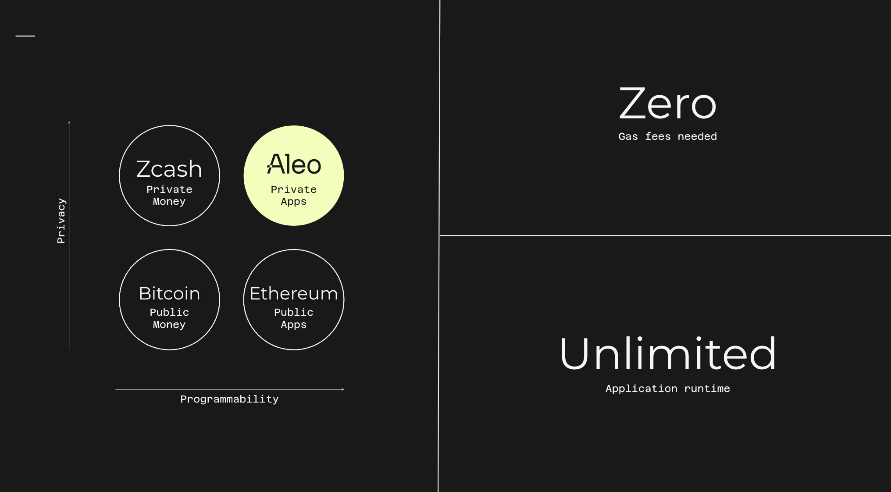
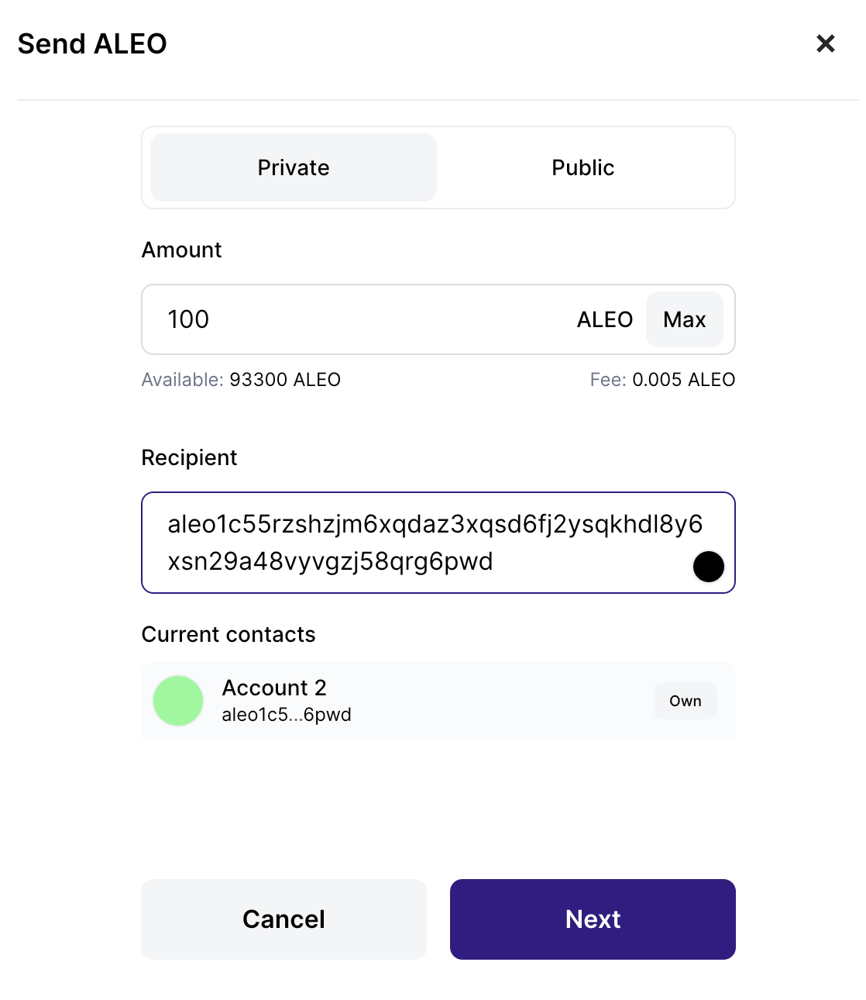
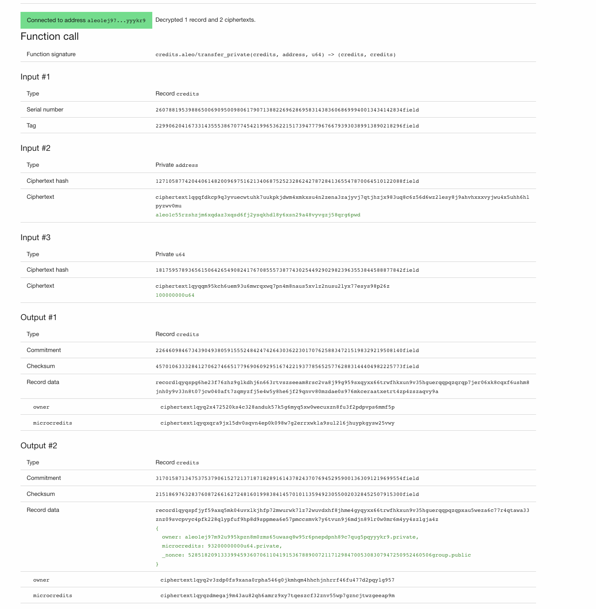
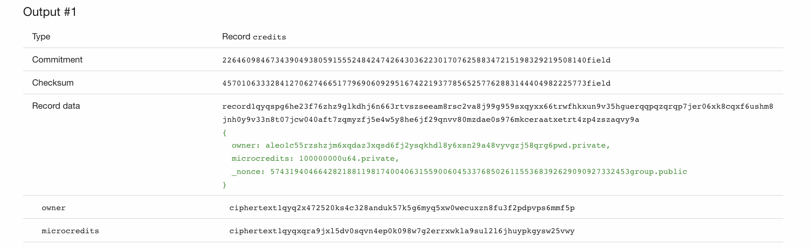
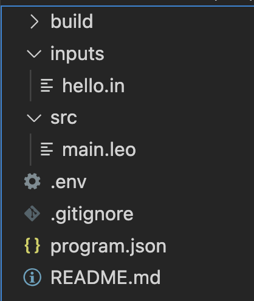
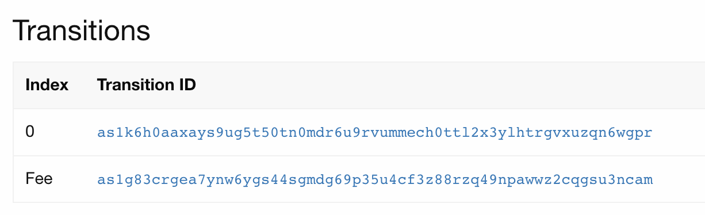
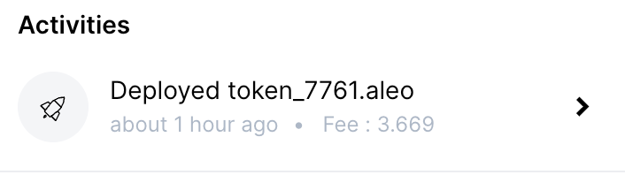
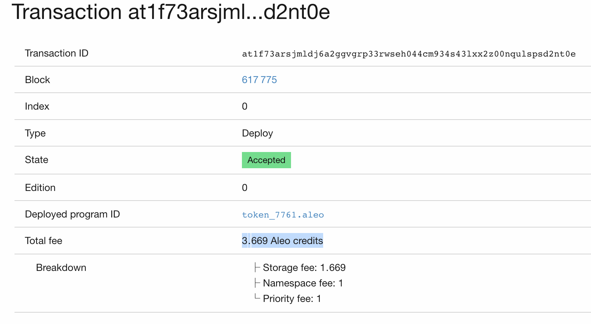
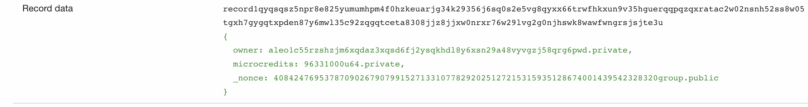
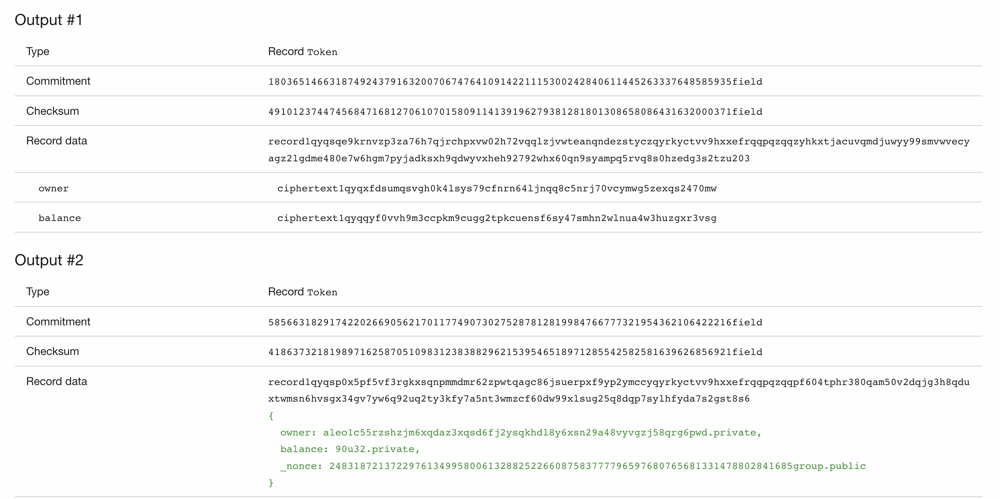

# Course - Workshop

## Video Guide

[](https://www.youtube.com/watch?v=dyv6lorra-g)

## Aleo Runthrough

In this workshop we will go through the basics of working with zero knowledge proofs, Aleo, and how to build private applications using the Aleo network.

Thats a lot of words, so let’s do a quick run through of what that means, a basic understanding of blockchain would be handy.

Aleo is a blockchain, or a decentralized ledger, allowing users to execute off chain and then finalize state on-chain. Using Zero knowledge proofs to allow for privacy.

## A Quick Aleo Introduction



Let me give you a 60 second intro to the Aleo blockchain so we are all on the same page.

We start with Bitcoin to allow for Decentralized transfers of value.

Ethereum innovated on this to allow for arbitrary code execution on a decentralized network, allowing many decentralized applications to be born.

Zcash built upon Bitcoin as well but in a different manner, with the goal of allowing for complete privacy of transactions.

These are all “layer 1” blockchains, in that they are their own entities and not built on top of another network. Where aleo fits in is it takes the programability of ethereum, the privacy of zcash, and wraps it up in to it’s own privacy focused layer 1 blockchain.

So if you’ve heard of ZK in the context of zk rollups, this is not a rollup, it’s its own blockchain allowing for decentralized AND PRIVATE apps.

<aside>
❗ The focus of this lesson is primarily the Leo language, so we will not deeply explore the architecture of the network, but more-so how to get started creating decentralized applications.

</aside>

## ZKP introduction

Aleo enables privacy using the magic of zero knowledge proofs. This is done for you all behind-the-scenes, so you don’t need to understand the inner workings of zero knowledge cryptography.

A zero knowledge proof allows you to 100% know that a user executed some code locally, AND it preserves any private inputs to that code.

So, a user can execute some code locally and provide a **proof** showing they executed the code correctly

**This adds 3 major benefits:**

1. Local input data remains private
2. zero execution gas fees needed
3. unlimited application runtime (no need to execute the same code across all nodes)

**Leo** is a programming language used to build apps on Aleo. This will build ZK circuits behind the scenes and execute within a virtual environment, allowing you to enforce users of your applications to execute code properly while maintaining privacy.

## Prerequisites

You can follow along within the playground for most of the Leo examples - https://play.leo-lang.org/

However as you build out more complex examples and want to deploy, you may want to move to a local environment. We will talk about the tools needed now.

Make sure you have the following software installed on your local machine:

### Software Installation

1. [Install Git](https://git-scm.com/downloads)
2. [Install Rust](https://www.rust-lang.org/tools/install)
3. [Install Leo](https://developer.aleo.org/leo/installation)
4. [Install snarkos](https://developer.aleo.org/testnet/getting_started/installation/)
5. [Install Leo Wallet](https://leo.app/) (Chrome)
6. [Install VSCode](https://code.visualstudio.com/download)

## Working with snarkos and the leo CLI

`snarkos` is the command used to interact with our Aleo node, so it will be used for things like deploying.

```
snarkos --help
snarkos start --help
```

`leo` is probably the command you will use more often, as it is the command used to interact with our application, or do basic things like create Leo wallets.

```
leo --help
```

There is some overlap between tools, so for example, you can create a wallet with both. I’ll generally prefer to use `leo` when possible. Let’s go through an example of creating a wallet next.

### Create a Leo Wallet

You will need a Leo Wallet to deploy your program. You can create a wallet by running the following command:

`leo account new`

The structure will look something like:

```
Private Key  APrivateKey1zkp57ZaLSVAQjEqfAMZ1QWbi7db3BBCmPkG6Q6fp4qryD6p
	 View Key  AViewKey1mMuL6pMbdQdK3Tqmw1og632Vz2Y9ZSJ5ctF48PhjK64r
		Address  aleo1yt7t660fx2675gapa8tr5k99cgl7klwsz3gtd9qzcfh0xklwxuqsauh8v6
```

Be sure to save the Address, View and Private Keys of this wallet, you will need them later.

**Alternatively you can**

-   Create the wallet via Leo Wallet if you installed the above Chrome Extension
-   Import the wallet into Leo Wallet you created via `leo account new` using the private key

1. private key — this is your ownership of the account, don’t share this with **anyone**.
2. Your address is ok to give out to people, this is how they send your credits.
3. view key — generally only give out to things that really need it.

You may be familiar with private keys and addresses, but what about the `view key`? In Aleo, transactions are private by default, and the view key is used to see your encrypted data. This means an app that has your view key can see your transactions. This is why its sometimes OK to give it out, but I wouldn’t broadcast it or you’ll lose much of the benefit of privacy offered by Aleo.

Here is an example transaction using the Leo wallet. I’ll send it to another account I own:



This will show up in an explorer like so:



This shows the change from the transaction and the encrypted output to the new address. We can see this with the other account.



## Record Model Explained

Aleo uses a model more similar to that of Bitcoin or the UTXO model compared to an account model.

We will go over some basic vocabulary:

-   A **record** is the smallest data structure for storing state. In our case, we are using a record to transfer Aleo credits from one address to another.
-   We then have a **transition**. If the records store state, a transition describes a change from one state to another. Through this process, records are consumed and created.
-   A **transaction**, the term most have probably heard, is a collection of transitions that will be published on chain.
-   Finally, a **block** is a collection of transactions allowing for a record of all state changes over time.

You can see this grouping by looking first at a block - https://explorer.hamp.app/block?h=604344

block —> transactions —> transitions —> records

## What makes up a Record

A record will look like:

```
record1qyqsqy4m2af2k4ncfdz9epcn0rr284z2tdqt67dcpya5cdk84w6yv7q9qyxx66trwfhkxun9v35hguerqqpqzq9wtmyxdukwnwxvqjt9x8pz8gta40g5v8lfkfgpl8k5tlgzg0elqrwt7earvar8zlza6twwzpzacymsy2ms083k0plr0nsc4slu9xwq2yzgrhj
```

or, if exposed using your view key:

```
{
  owner: aleo1ej97m92u995kpzn8m0zms65uwasq8w95r6pnepdpnh89c7qug5pqyyykr9.private,
  microcredits: 93300000000u64.private,
  _nonce: 2537482171121567559953927872334058167419291196003242761090252325051232141276group.public
}
```

This contains an owner and microcredits, which is the smallest division of an Aleo credit.

https://developer.aleo.org/concepts/transaction_fees/#aleo-credits-denomination-table

The `_nonce` is just a unique identifier for this record, so the number has no significant meaning.

## Creating a Project

Run the following command to initialize a Leo project.

```
leo new hello
```

The result will be a new folder `hello` with the following structure:



Code is written in `main.leo`.

```
program hello.aleo {
    transition main(public a: u32, b: u32) -> u32 {
        let c: u32 = a + b;
        return c;
    }
}
```

This describes a program with a **Program ID** called `hello`. Then, we have a `transition`. parameters of type `u32` (integer) and a return of `u32`. This just adds up the values in C and returns C.

To see this execute:

```
leo run main 10u32 5u32
```

this should give 15u32

## Example zkproof -

To quickly see zk proofs in action, while kinda silly, this will prove that B is an even number.

```
program hello.aleo {
    transition main(a: u32, b: u32) -> u32 {
        assert_eq(b.rem(2u32), 0u32);
        let c: u32 = a + b;
        return c;
    }
}
```

```
leo execute main 3u32 5u32
```

When people say that the inputs remain private, it is specifically referring the arguments to this transition function. So the value 5 is not exposed.

This is a basic example, but illustrates how a ZKP will work.

## Token Example

In Leo, deployed programs must be unique, so make sure to use a unique name.

`leo new token_$RANDOM`

Write your code in the `src/main.leo` file. For this demo we will be using the following code that implements a basic token.

First, let’s create a `Token` record and a `mint` transition.

```
// Replace <project_name> with the name of your project.
program <project_name>.aleo {
    // Define a token struct with an owner and balance
    record Token {
        owner: address,
        balance: u32,
    }

    // Define a mint transition that takes a balance and returns a token
    transition mint(balance: u32) -> Token {
        return Token {
            owner: self.caller,
            balance: balance,
        };
    }
}
```

The transition takes a value as an argument, crafts a new record with the owner being whoever invoked this. You can grab the callers address with `self.caller`. This will then create a record containing a certain amount of tokens and it will be owned by the minter.

How do we invoke this?

`inputs_7761.in`

```jsx
[mint]
balance: u32 = 100u32;
```

This defines a call to `mint` with a balance provided of `100u32`.

`100u32` is how you create an integer literal value of 100

```jsx
leo run mint
```

## Input vs CLI args

The input file is one way of calling, another is:

```jsx
leo run mint 1000u32
```

Let’s add a way for the minter to transfer these tokens.

## dAPP Account

When you call this code it will default to some address. here is the record it returns —

```jsx
{
  owner: aleo1cyvqu92pjwyk8kymrpvpp4ldqj20snuwvgts7xdchnuv7tngtgzq596uev.private,
  balance: 1000u32.private,
  _nonce: 7978934609608208710969614548966631084002584491357999482208457456770937141137group.public
}
```

This is an account that is automatically generated for your project, you can see this information inside of the `.env` file:

```jsx
NETWORK = testnet3;
PRIVATE_KEY = APrivateKey1zkpJ1D2iM2JJg2YCtfRiEVtz29fnXAeaHhDzSx3RvNxF5sj;
```

## Transferring Tokens

```jsx
// Define a transfer transition that takes a receiver, amount and token and returns two tokens
transition transfer(receiver: address, amount: u32, input: Token) -> (Token, Token) {
    let balance: u32 = input.balance - amount;
    let recipient: Token = Token {
        owner: receiver,
        balance: amount,
    };

    let sender: Token  = Token {
        owner: self.caller,
        balance
    };

    return (recipient, sender);
}

```

<aside>
💡 In a record model, The only thing that can happen to a record is it being spend/destroyed. This means, if we want to create new tokens, we must destroy the previous record. This is why we return two values. You can think of the first as the destination, and the rest as **change** that gets returned to the caller.

</aside>

### Define Inputs for Transfer

Let’s describe a transfer call. We will transfer 10 tokens to our wallet we created at the beginning. So copy over your `address`, type in an amount, and then copy over the input record from the `mint` call.

```

[transfer]
receiver: address = aleo1yn6halw6astkc8jsl88sukelef3e8xrawugfjtx7kjcuuxdm6spsdtc249;
amount: u32 = 10u32;
input: Token = Token {
  owner: aleo102nryeeun6da4atqggu0q9aj5cqem7tpjzvce4nc88yzu29n8sgs9qelp7,
  balance: 100u32,
  _nonce: 661901642905281065575358583071347542160248627750537954509114007526888699661group
};

```

Copy the output record from the mint transition and paste it into the `./inputs/project_name.in` file under the `[transfer]` section. Be sure to remove the `.private` and `.public` suffixes.

<aside>
💡 You will only need to modify the suffixes for the input file. When we deploy later, you can leave the plaintext record untouched

</aside>

```
       Leo ✅ Compiled 'main.leo' into Aleo instructions

⛓  Constraints

 •  'deploy_workshop.aleo/transfer' - 4,075 constraints (called 1 time)

➡️  Outputs

 • {
  owner: aleo1yn6halw6astkc8jsl88sukelef3e8xrawugfjtx7kjcuuxdm6spsdtc249.private,
  balance: 10u32.private,
  _nonce: 3050046340461200467640466967043652446168052649619713936697821365575779437863group.public
}
 • {
  owner: aleo102nryeeun6da4atqggu0q9aj5cqem7tpjzvce4nc88yzu29n8sgs9qelp7.private,
  balance: 90u32.private,
  _nonce: 7955845234401838954345597221810328519950488237684582098690500295625246536712group.public
}

```

You can see here, one account now has 90 tokens and the other has 10, meaning we successfully transferred 10 tokens.

## Running transfer from the CLI:

While cumbersome, let’s go through an example of running this through the CLI instead of with the inputs, which will be important later.

```
leo run transfer "aleo1jk6w8vcz3uaxqq9kmt8ma6pr4ql4lk78mudw9cmdel2r0n9l05xsxayd22" 10u32 "{
  owner: aleo1cyvqu92pjwyk8kymrpvpp4ldqj20snuwvgts7xdchnuv7tngtgzq596uev.private,
  balance: 100u32.private,
  _nonce: 5767118151707852209603951778921293269306139471593151514682010808545622106653group.public
}"
```

We do not provide the types and just pass the literal values, **adding back in the suffixes**.

# Deploying

When developing locally you don’t need testnet credits, but if we want to deploy, we will need some.

### Testnet Credits

Aleo is currently in testnet, so everything we are working with is just for testing purposes. You can get testnet tokens by using the [Aleo Faucet](https://faucet.aleo.org/). We are also improving the faucet, so you can use this experience or reach out to everyone in Discord and someone will get you some credits.

All you need is your address and the credits will be sent to your account.

Once we receive our testnet credits they’ll show up in the leo wallet

### Finding our Record in the Explorer

We need to retrieve our Wallet's current record plaintext to deploy our program. I prefer to use the Leo Wallet to do this

-   Open the Leo Wallet
-   Click on the Wallet you created
-   Click on the Activities tab and click into the most recent transaction, this opens a new window in a block explorer
-   You should see this page
    

-   Click on the first transition ID, this will open a new page.
-   Connect your wallet, scroll down and retrieve your **record data**, it should be highlighted in green text, keep this open for the next step

<aside>
💡 This record is going to be used as an input for the deployment. If you recall from earlier after we mint, we used the new record as the input for the transfer. This is required to make a transition.

</aside>

### Create our Deployment

```
snarkos developer deploy --help
Deploy a program

Usage: snarkos developer deploy [OPTIONS] --private-key <PRIVATE_KEY> --query <QUERY> --fee <FEE> --record <RECORD> <PROGRAM_ID>
```

here is the description for the deploy call, but we need to fill in a lot of values, so it may be easier to write it out in a file.

Create a new file named `deploy.sh` in the project directory, here we will define any variables needed for a deployment.

```
APPNAME="token_7761"
PRIVATEKEY="APrivateKey1zkp8CJ8Kco3EMJYDcUm1TTGqw9KU9GDxRxKZCHXWnW3tk5c"

RECORD="{
  owner: aleo1c55rzshzjm6xqdaz3xqsd6fj2ysqkhdl8y6xsn29a48vyvgzj58qrg6pwd.private,
  microcredits: 100000000u64.private,
  _nonce: 574319404664282188119817400406315590060453376850261155368392629090927332453group.public
}"

snarkos developer deploy "${APPNAME}.aleo" --private-key "${PRIVATEKEY}" --query "https://vm.aleo.org/api" --path "./build/" --broadcast "https://vm.aleo.org/api/testnet3/transaction/broadcast" --fee 1000000 --record "${RECORD}"
```

Fill out the variables with the appropriate values and save the file.

### Step 5. Execute the Script to Deploy our Program

Run the deploy script

`. ./deploy.sh`

You see output of the transaction ID if successful

```
Successfully broadcast deployment at1f73arsjmldj6a2ggvgrp33rwseh044cm934s43lxx2z00nqulspsd2nt0e ('token_7761.aleo')
```

Take this value and paste it in explorer.

Additionally, if you forget this value, you can look at your wallet txn history in the Leo wallet.



## Fee structure

The input token record, likely originating from a faucet or peer-to-peer aleo credit transaction, will have a `microcredits` value. The plaintext example used for deployment may look like this:

```
RECORD="{
  owner: aleo1c55rzshzjm6xqdaz3xqsd6fj2ysqkhdl8y6xsn29a48vyvgzj58qrg6pwd.private,
  microcredits: 100000000u64.private,
  _nonce: 574319404664282188119817400406315590060453376850261155368392629090927332453group.public
}"
```

In the output transition, it’ll look really similar with a decreased `microcredits` value.

```
{
  owner: aleo1c55rzshzjm6xqdaz3xqsd6fj2ysqkhdl8y6xsn29a48vyvgzj58qrg6pwd.private,
  microcredits: 96331000u64.private,
  _nonce: 4084247695378709026790799152713310778292025127215315935128674001439542328320group.public
}
```

If you get the difference, you’re left with 3669000. If you inspect the transaction in the explorer, this is the exact fee amount.



## Interacting with the contract

You’ll find the record returning your balance to your wallet in the deployed transaction transition’s records.



Now, we will use `execute` to invoke `mint` on chain:

```
snarkos developer execute --help
Execute a program function

Usage: snarkos developer execute [OPTIONS] --private-key <PRIVATE_KEY> --query <QUERY> <PROGRAM_ID> <FUNCTION> [INPUTS]...
```

This will no longer take a `--path` as we are not giving it our build files, instead, we will provide a `<FUNCTION>` and `[INPUTS]`.

Let’s create a `mint.sh`

```
APPNAME="token_7761"
PRIVATEKEY="APrivateKey1zkp8CJ8Kco3EMJYDcUm1TTGqw9KU9GDxRxKZCHXWnW3tk5c"

RECORD="{
  owner: aleo1c55rzshzjm6xqdaz3xqsd6fj2ysqkhdl8y6xsn29a48vyvgzj58qrg6pwd.private,
  microcredits: 96331000u64.private,
  _nonce: 4084247695378709026790799152713310778292025127215315935128674001439542328320group.public
}"

snarkos developer execute "${APPNAME}.aleo" "mint" 100u32 --private-key "${PRIVATEKEY}" --query "https://vm.aleo.org/api" --broadcast "https://vm.aleo.org/api/testnet3/transaction/broadcast" --fee 1000000 --record "${RECORD}"
```

`. ./mint.sh`

```
✅ Successfully broadcast execution at1m9qvagzmwhrjzhw08dun6rnqfazm0ckez7c0z3r4cra83kff3uxqjlthex ('token_7761.aleo/mint')
```

Looking at the response transaction ID in the explorer:


You’ll see the call to `mint`.

This is where you’ll get the record plaintext for any future transfers.

and the second one (Fee) is where you’ll find the record for the next transaction.

## Transferring Tokens on chain

Same idea, we’ll create a `[transfer.sh](http://transfer.sh)` script.

This time, we’ll use the new mint transaction as the input record.

We will also create a new receive address to test transferring this token to:

```
leo account new
```

```
Private Key  APrivateKey1zkp4yaSYFhJmzkR9Yk1YCaxcN16ePbbMwpjUGTQiSZ24yq7
	View Key   AViewKey1pJJMt5do5Vc6dpAtbwPh4PkEdL6VeJj8YNK6WZVuZVpo
	Address    aleo1z40kp2arrupw473024vre435fk7mv6ulerw692qx7908g768zcrszkdc00
```

The `Address` value will be used as the `receiver` argument (right after the transition function name).

We will now need an input record of the `mint` (we will call it `RECORD`) and an input record for the fee (we will call it `RECORD_FEE`).

`RECORD` will be used as argument to `transfer`

`RECORD_FEE` will be used as the value for the `record` option

```
APPNAME="token_7761"
PRIVATEKEY="APrivateKey1zkp8CJ8Kco3EMJYDcUm1TTGqw9KU9GDxRxKZCHXWnW3tk5c"

RECORD="{
  owner: aleo1c55rzshzjm6xqdaz3xqsd6fj2ysqkhdl8y6xsn29a48vyvgzj58qrg6pwd.private,
  balance: 100u32.private,
  _nonce: 6078705006041847091314745908254701368890593599208630138779354117407843960967group.public
}"

RECORD_FEE="{
  owner: aleo1c55rzshzjm6xqdaz3xqsd6fj2ysqkhdl8y6xsn29a48vyvgzj58qrg6pwd.private,
  microcredits: 95329696u64.private,
  _nonce: 1651644717769509739489059217002418707717751241393400439399336449981599681299group.public
}"

snarkos developer execute "${APPNAME}.aleo" "transfer" "aleo1z40kp2arrupw473024vre435fk7mv6ulerw692qx7908g768zcrszkdc00" "10u32" "${RECORD}" --private-key "${PRIVATEKEY}" --query "https://vm.aleo.org/api" --broadcast "https://vm.aleo.org/api/testnet3/transaction/broadcast" --fee 1000000 --record "${RECORD_FEE}"
```

```
✅ Successfully broadcast execution at1wqe65jvdmz4z4g5yav0r08hfhaf9a6njp5u0w4ka7hqqkefy3y9qt7xn98 ('token_7761.aleo/transfer')
```

## Confirming Receipt of Token

We will look at the transaction ID in the explorer and find the transfer transition call. Take a look at the transfer output records



We can only see the `output #2`, output #1 is still private.

This is because if you recall from our transition function:

```
return (recipient, sender);
```

Only the recipient is able to decrypt the encrypted on chain state that is encrypted to them.

-   Import the recipient to leo wallet
-   refresh page
-   reconnect
-   now you should see the recipient data

Obviously this is cumbersome, copying records and what-not, but we are doing it pretty low level, you could abstract a lot of this away with tools such as wallets or DEXes or even a basic SDK in whatever language you choose.

## A ZKP Example

Currently, anyone can mint new tokens.

We can prevent this by only allowing a certain address to mint:

```
transition mint(receiver: address, balance: u32) -> Token {
        assert_eq(self.caller, aleo1c55rzshzjm6xqdaz3xqsd6fj2ysqkhdl8y6xsn29a48vyvgzj58qrg6pwd);
        return Token {
            owner: receiver,
            balance: balance,
        };
    }
```

This new code will:

1. make an assertion which will fail if someone other than me tries to mint
2. Allow us to mint to any address and keep that input private

We will update the input file and test this locally

```
[mint]
receiver: address = aleo1z40kp2arrupw473024vre435fk7mv6ulerw692qx7908g768zcrszkdc00;
balance: u32 = 100u32;
```

You can execute this with

```
 leo execute mint
```

or without the input file

```
leo execute mint "aleo1z40kp2arrupw473024vre435fk7mv6ulerw692qx7908g768zcrszkdc00" 100u32
```

<aside>
❗ note to use execute not run to create the zero knowledge circuit (this takes a while)

</aside>

TO test this out locally we can adjust our caller in our `env` file:

We will set this to the private key of the address being asserted against:

```
NETWORK=testnet3
#PRIVATE_KEY=APrivateKey1zkp26aE6HocVYCrLwtr42SMVx8ukPsoa7t5Dv7CLjQpJQyk
PRIVATE_KEY=APrivateKey1zkp8CJ8Kco3EMJYDcUm1TTGqw9KU9GDxRxKZCHXWnW3tk5c
```

Now, the mint will be executed with this account being the caller, which should match 1:1 for the address required.

This will give us a valid proof and we will see something like:

```
➡️  Output

 • {
  owner: aleo1z40kp2arrupw473024vre435fk7mv6ulerw692qx7908g768zcrszkdc00.private,
  balance: 100u32.private,
  _nonce: 5706590093464757989957972673537594703015613607064894941895296225415772126713group.public
}

{"type":"execute","id":"at1hnv36lp537g4uql84dtgsrssanqfuzd62ege8dze6aruf7qzwc9s4ckv8j","execution":{"transitions":[{"id":"as1jvw5ttgjtf4eksa85ceyca4j2k37usjnhd6yxgs4wqn5wq42pqgsc2g954","program":"token_7761.aleo","function":"mint","inputs":[{"type":"private","id":"3667058459223475480509684079990909321998979108510347437965224966513390366489field","value":"ciphertext1qgqw4lwx703pxklyvt0tmdda6medgl9324k38ga8zadu8yzcrnsgkyddcm2t5kgraq3ekuncqhl99zh6w5jzyf4rm5hp085ma8cvvqf7zy3pla23"},{"type":"private","id":"3504843519135282418225006736472148297492117286413234937981585316667140853188field","value":"ciphertext1qyqp7a0eks0hvrgd3sd4pqfvue5yjxf5uvxxzd6vv99uggu9y28xjyqw4gcm5"}],"outputs":[{"type":"record","id":"2026569964131654358488017372078548229214903485797013069451473684408119508792field","checksum":"8272609804312192543732303490200005662258966870731003521071351254123882532371field","value":"record1qyqsqhakng0kqgcl2tpr0tmw57k77l7k9k6v8p84ca53xes7n6q9kagdqyrkyctvv9hxxefrqqpqzqxrehnktryh9fpy3nc3jsnfferh6fh6u00v6y7xj3dh4z0esrqfqlun634lh5ac46atqr3jgrk0tahp20wqfaln8d0w7jlvd0wx6zwsc7cknaq"}],"tpk":"717367106644845131396232716123198304402016148604058826021957554675858200650group","tcm":"7807298241405452572541250040852492739749011239240760319217476359736392717967field"}],"global_state_root":"ar1p9rd3p75r3jw3kpmfjfyzr7yyzltm4wng3zczzp0g8gcntw3x5pse6axdw",**"proof**":"proof1qqqsqqqqqqqqqqqpqqqqqqqqqqqgegv7ng9ewk3y5upx22pjkysfl4kt7kp2zhlpr5lxzc2hguh5a6r7rxdwglnahy590kc3fuec0suqqhnn0uxcrvhr43tawt9pvkj69t6kdjrkk0r8t0yd7kdhuu8h47n760ygc5q0wjgcz3sgavzp8kwcrhe4rvyzl32ttfwrn707h2heuyshp4jruxmcny5cjwerdjd5pq2sfhv4l33f5jmmh0yy8t3zvmz0syq3ktzc53wxt3fufd8xcldp8uaez44et9x5lxhqksmc609npzxu8kn6jqlyper6tqzhzxpx52mn2tqpk6y8gyj3af55wgc0gn9g9h0g6s5vfh4r296mvn2u4ws0xt9yaqqh65mef4qay930q3huumhcl7ncral9eqtz737nhvgmgkqeuv3egczn5737tacvqltw7t8y3gqg65x787sk4w732u3kmtn6fsh4gufhsz5k0pw0r5399ydy6gvg0u20lwwj0juh2hx4mpcwkd9zer37gn97lgr6ewjxgkmqlaw4lwgrpvz36q0qupa7gpy2y674qkmtfhnajv8fasmd7trjxlcj0g6ekpxycyv8ztzfz3uxr4gk9y9jjssrpz8tf6qazfv9vljrepx4mvet3c706vhfj72lddhv47y8qcgz3xnlrw64zqhz3zrsqwrweuenw2md6ve450cqsvcsvsfy6nkn2tx9ld2fy0myltkgwua63sng64de9xu7fk0j2x569wtn4qmtrg7ym9s56rq6vkygqq5k3hct59s3nnknuhaz2ykjjsrel70xspj6jk6hyjuaewzea7q3c235yljjt0mcugzpqufu0mwk690texdtm4xm6dsy0adsxkhgjuzz8kcq6a5uw6w4clgccfwayrpnvjwu9zj26lfsjax4hqdvn5tfsr0y89397ldvkxn0f7mf3kufqq3g7sm4yudx438dn6zezu0pgm2jqd4d0p2nfam550mdfm0p53emu06n3fwvahcps2sd0kstfydc7gaquqgqqqqqqqqqqqyxh4vxpqwdj6uwf4s76ktn45vqvzppqpns0ynz4cxsdv674jdszlayrvjhm0wl6j2ag3ykpxkuvxcuhr2ury7ml66zkzc587ynu0szflz24nr9t4avh6m2dwt6crrz4jr2sgm6n96yg2txda7j6308j5yqyqqqqqqqqqqqj2dsehxjyr3g6ne64dj8a5garmaj828pgtnms0hn2r04fnfk8rhj4728wzx46vc9ec7ww8cuda4szqw5jyu0m52pyzpckpnxp3mpxarslyd4d3zgzcvqwc5p5njk45ykp8hllvn8lergrluag6sugk9xkzxqlah6t4l3d94pz0w3ggu8lsfjt25vrx47z54jgak6qt2esug0zqqqqqtt7cxx"}}
```

Notice the `proof` attribute. that is the actual proof value, which validates our efforts and means we have a valid transition.

**If you wanted to now, you could build upon this and deploy a new contract.**

## What’s next

This was a lot of information. Up next you would want to learn to interact with the chain in a more manageable way. We learned the primitives in this lesson, but now you could start building software to do this for you. We have some starter code and examples here:

https://developer.aleo.org/sdk/typescript/overview

And example usage of what it could look like in a web environment in `aleo.tools`

https://aleo.tools/account

https://github.com/AleoHQ/sdk/tree/testnet3/website/src/tabs

This is some of the code for the actual website where you can see how it is being implemented.

in depth info in this readme - https://github.com/AleoHQ/sdk/tree/testnet3/sdk#24-local-program-execution
